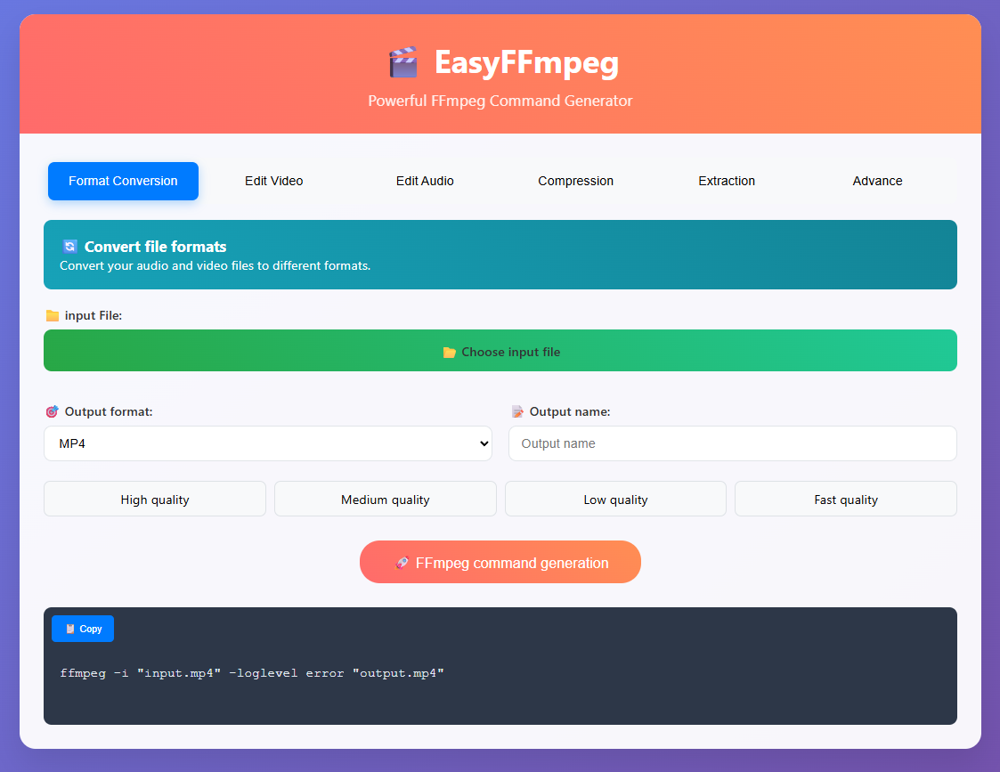

# SimpleWebGUI for FFmpeg

A beautiful and intuitive web-based GUI for generating FFmpeg commands.

## 🌟 Features

- 🎥 Convert videos to different formats (MP4, AVI, MKV, etc.)
- 🛠️ Apply video filters (brightness, contrast, sharpen, scale, deinterlace, flip, etc.)
- 🔊 Customize audio settings (bitrate, sample rate, volume, noise reduction)
- 💾 Extract audio, frames, subtitles, or thumbnails from video files
- 📦 Compress video using CRF and presets
- ⚙️ Use advanced FFmpeg parameters (codecs, threading, etc.)
- 📋 Copy the final FFmpeg command with a single click

## 🚀 Getting Started

### Prerequisites

- A modern web browser (Chrome, Firefox, Edge, etc.)
- Basic understanding of FFmpeg (optional but helpful)

### Usage

1. Download or clone this repository.
2. Open `index.html` in your browser.
3. Use the interface to configure your desired FFmpeg command.
4. Click **"🚀 FFmpeg command generation"** to generate the command.
5. Copy and use the command in your terminal with FFmpeg installed.

## 📁 File Structure

```
SimpleWebGUI/
│
├── index.html   # Main interface
├── style.css    # UI styling
└── script.js    # Command generation logic
```

## 📷 Preview

> A clean interface with tab-based navigation for video, audio, compression, extraction, and advanced settings.



## 🧠 Technologies Used

- HTML5
- CSS3
- Vanilla JavaScript

## 📜 License

This project is licensed under the MIT License.